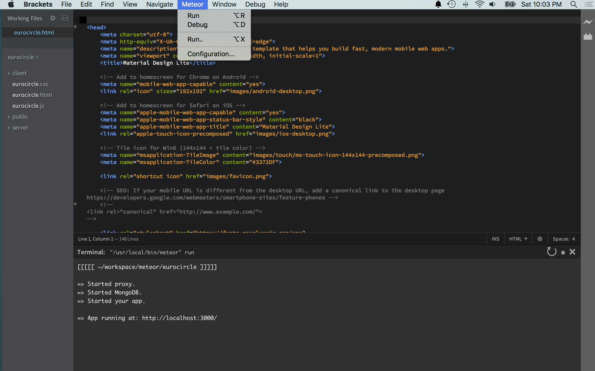

#Brackets-Meteor
This brackets extension integrate meteor in the Brackets editor.

## Usage
Open a meteor project then se the new added menu `Meteor`.

* `Run` runs the current opened meteor project.
* `Debug` runs meteor in debug mode in the current project.
* `Run..` executes any meteor command by typing custom argument.

### Note: 

* Shortcut are available to automate command execution: Alt-R, Alt-D, Alt-X  
* When meteor process must be stopped a `SIGTERM` is send to "kill" parent or child processes related to meteor..

## Installation

__Not available yet because of a bug in the brackets repository__
Use the extension manager (File > Extension Manager) and search for `meteor`.
There you can install `Meteor`.

*From GitHub (newest version):*
`File` > `Extension Manager` > `Install from URL` > `http://github.com/jvmvik/brackets-meteor` > `Install`

Enjoy.
